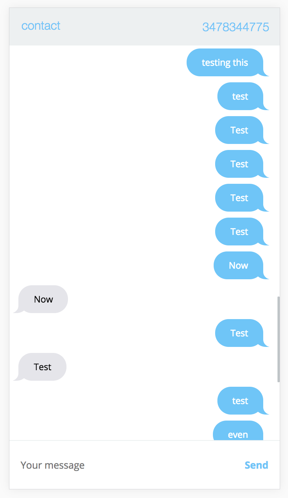

# imessage-anywhere

iMessage in your browser!  

Tiny web app that brings iMessage to your browser! With a little effort this can be accessed remotely and you can use iMessage on your Android, Windows or any device!

# Basic Use!
Enter a number in the box to contact that person. 
Now type in the box on the bottom press enter and the message will be sent. 

Note-  
You need a working Apple Account and web accessible Mac product.

## Limitiations. 
This only supports a single client, due to the way it updates messages. Otherwise you may have refresh to get new messages.  

## Install. 
cd into imessage-anywhere. 
sh install.sh. 

## Run. 
sh start.sh

## Requirements.  
ao you need macbook with homebrew installed.  
also you to be signed into your imessage app. 

## How this works. 
Simple, we use a ruby package called imessage that allows you to send messages via the command line. That is wrapped up in a python class to handle all the outgoing messages. Then to handle the incoming we just define a tiny SQLite query that polls the most recent message to handle all the incoming messages. Whenever a new message is detected we read the database and show the messages in a flask app. 

## Local Network.
Change the line 
`var domain = "localhost"`. 
to the ip address that your laptop is - ie. 192.168.1.10
hold OPTION and click the wireless symbol in the top-bar to get this info.

## Remote Network.
Its cool when you can send a iMessage via any device on your local network, butttt the long term goal is for sure to access iMessage from anywhere.  

A way to achieve this is to create an endpoint that can access your local machine's ports 5000 (API backend) and 8000 (client UI). Then you can access the application at that local address.  

This is not secure, and a reverse proxy should be used to at least use basic auth and SSL encryption. (should provide documentation later).  

EXAMPLE COMMANDS:  
local-  
start the application locally (open iMessage too). 

remote-  
ssh -L 8000:remote-host:8000 user@remote -i "keyfile.pem"  
ssh -L 5000:remote-host:5000 user@remote -i "keyfile.pem"
